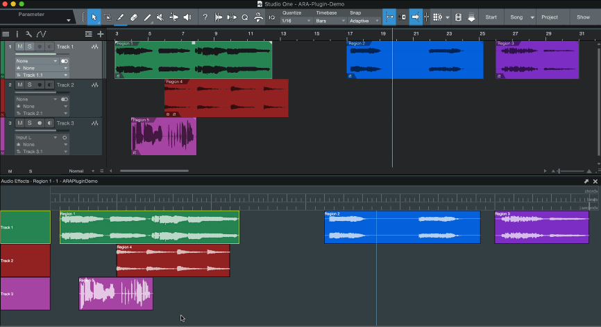
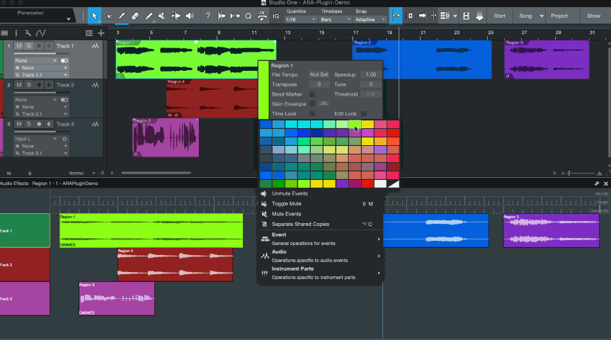
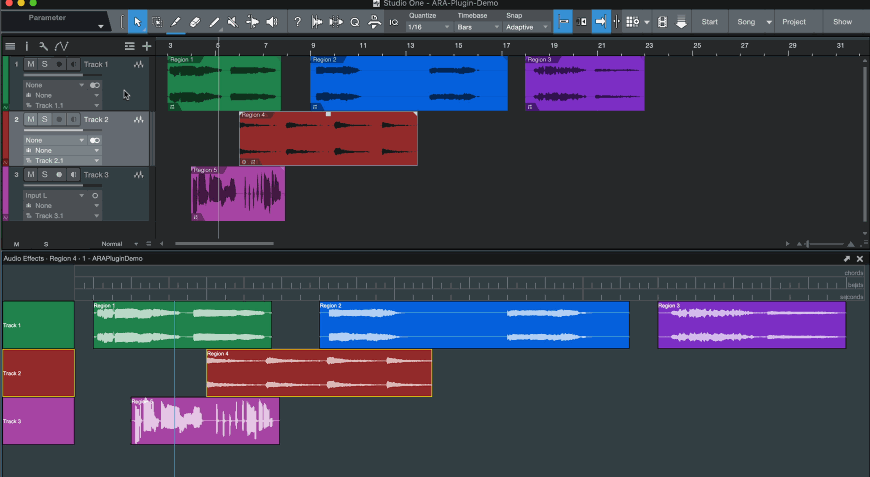
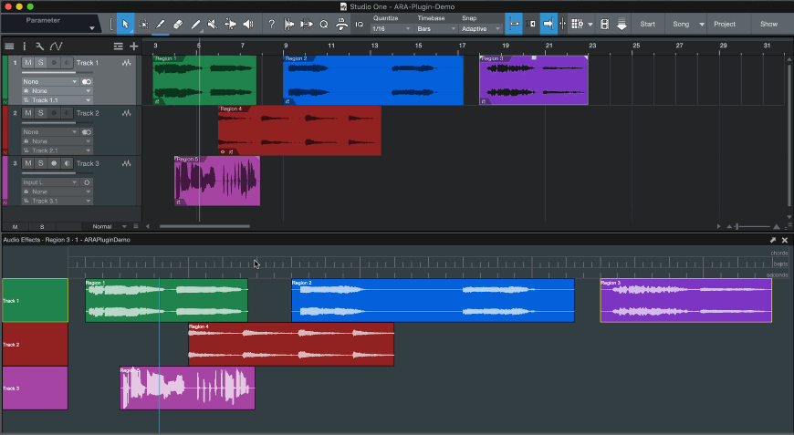

## ARAPluginDemo

In addition to the sample ARATestPlugIn provided in the ARA SDK, we've worked with SoundRadix to create a demo plugin project showcasing the experimental [JUCE_ARA](https://github.com/Celemony/JUCE_ARA) additions to the JUCE API, as well as ARA's general UI integration features.
This project can be found at [JUCE_ARA/examples/Plugins/ARAPluginDemo](https://github.com/Celemony/JUCE_ARA/tree/develop/examples/Plugins/ARAPluginDemo). 
The plug-in has a few features designed to be educational for both host and plug-in developers that we will outline below. 

### Modifying Audio Output

By default, the original audio samples from the underlying audio files are being played back unaltered. The (not very useful) optional DSP that the plug-in implements is dimming the signal by about 12dB.
To toggle the dimming, double click a playback regions in the plug-in UI - this will toggle the state in the audio modification for that playback region, e.g. all regions that are based on that modification will be dimmed.

This state gets persisted as a part of the ARA document; see the stream persistence functions of our [ARAPluginDemoDocumentController](Source/ARAPluginDemoDocumentController.h) for more details. 

### Model Object Property Visualization

The [RegionSequenceHeaderView](Source/RegionSequenceHeaderView.h) and [PlaybackRegionView](Source/PlaybackRegionView.h) classes will draw the name and color of their respective model objects by listening to changes in their properties. See their `ARARegionSequence` and `ARAPlaybackRegion` callbacks for more details. 

### Selection

By listening to the `ARAEditorView` instances, the [RegionSequenceHeaderView](Source/RegionSequenceHeaderView.h) and [PlaybackRegionView](Source/PlaybackRegionView.h) classes respond to changes in the host's region or track selection. Selected objects will be bordered by a yellow rectangle. See their `ARAEditorView` callbacks for more details. 

### Musical Context Content

The [MusicalContextView](Source/MusicalContextView.h) class draws a musical ruler containing chord, bar signature, and tempo data.
It uses the pitch interpretation and timeline conversion utilities provided with the ARA SDK Library to properly draw the rulers at the correct bar signature and tempo. 

### Host Playback Control

Our plug-in can use the host supplied ARAPlaybackControllerInterface to control host playback. The host transport position can be set by clicking on the musical timeline ruler, and the host will start playback if the ruler is double-clicked. See the [MusicalContextView mouse handlers](Source/MusicalContextView.cpp) for further details. 

